# Ứng dụng Quản lý Thuê xe Ô tô

Ứng dụng web cho phép khách hàng tìm kiếm, đặt thuê xe ô tô và quản lý lịch thuê, đồng thời hỗ trợ quản trị viên quản lý xe, hợp đồng và khách hàng.

## 🚀 Chức năng chính

**Khách hàng**

- Đăng ký, đăng nhập, quản lý thông tin cá nhân.
- Tìm kiếm, lọc xe theo loại, giá, hãng.
- Đặt thuê xe, quản lý đơn đặt thuê.

**Quản trị viên**

- Quản lý danh mục xe, loại xe, hợp đồng thuê.
- Quản lý thông tin khách hàng.

## 🔧 Công nghệ sử dụng

### 💻 Backend:

- **Ngôn ngữ:** Java (Spring Boot)
- **Framework:** Spring Boot
- **Database:** MySQL
- **ORM:** Spring Data JPA (Hibernate)
- **API:** RESTful API
- **Bảo mật:** Spring Security
- **Test API:** Postman

### 🎮 Frontend (Android App):

- **Ngôn ngữ:** Java
- **Framework:** Android SDK
- **Networking:** Retrofit2
- **UI:** XML + View Binding
- **Quản lý dữ liệu:** Room Database / SharedPreferences
- **Kiến trúc:** MVVM

---

## 📷 Demo giao diện

<h3 align="center">Đăng ký, đăng nhập</h3>
<p align="center">
  
  
  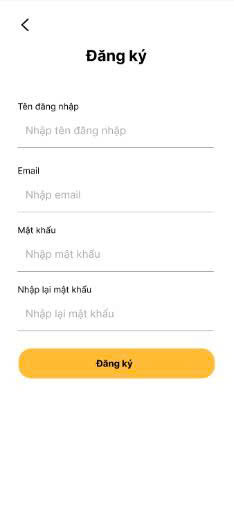
</p>

<h3 align="center">Trang chủ</h3>
<p align="center">
  
  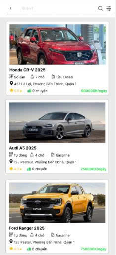
   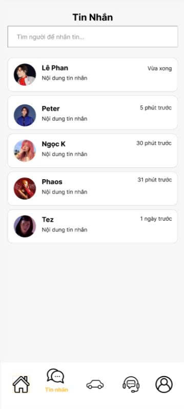
</p>

<h3 align="center">Cá nhân</h3>
<p align="center">
  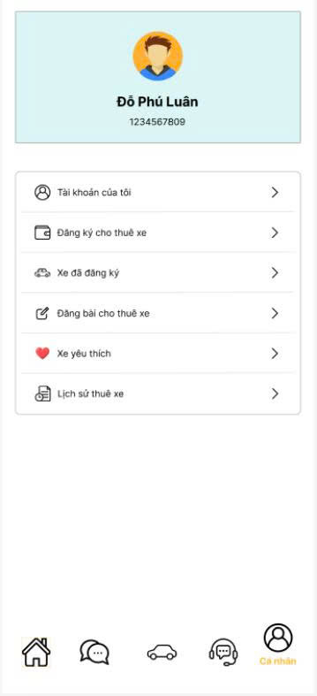
  
</p>

<h3 align="center">Đăng ký và cập nhật xe</h3>
<p align="center">
  
  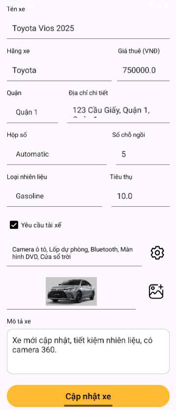
</p>

<h3 align="center">Chi tiết xe</h3>
<p align="center">
  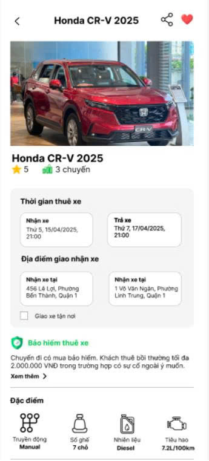
  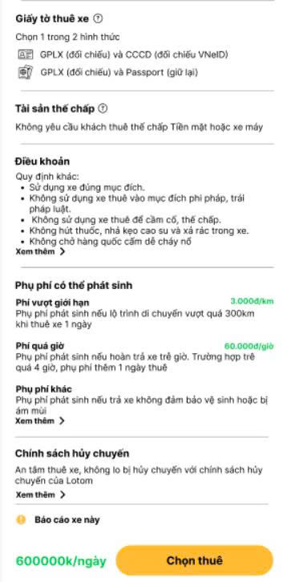
</p>

<h3 align="center">Đặt xe</h3>
<p align="center">
  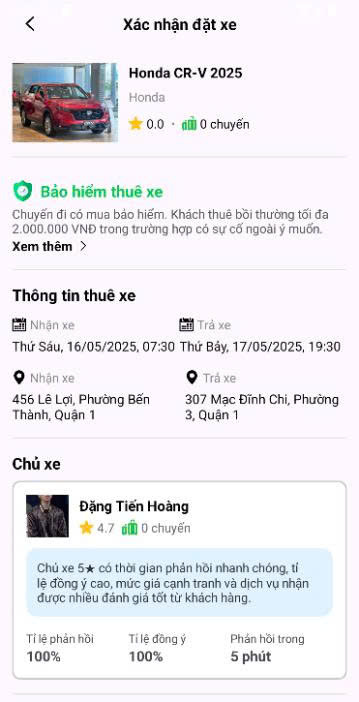
  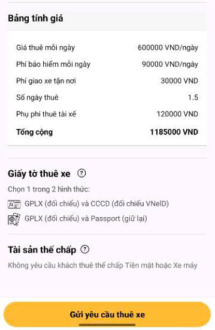
</p>

<h3 align="center">Chi tiết đặt xe và reveiew</h3>
<p align="center">
  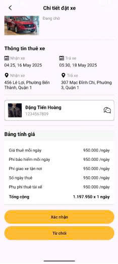
  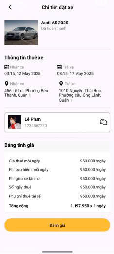
</p>

## 📥 Cài đặt & chạy dự án

1. Clone repo:
   ```bash
   git clone https://github.com/hmman444/ThueXeOto.git
   ```
2. Import Project App vào IntelliJ IDEA và Project API vào VSCode.
3. Cấu hình kết nối cơ sở dữ liệu bằng cách import các file .sql vào MySQL.
4. Chạy dự án trên Apache Tomcat.

## 📄 Tài liệu

- [Báo cáo của dự án](docs/BaoCao.docx)

## 📬 Liên hệ

- **Email:** luandophu8114@gmail.com
- **GitHub:** [LTDD](https://github.com/phluaan/ThueXeOto)
